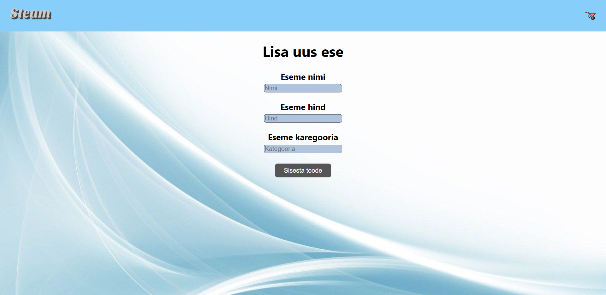
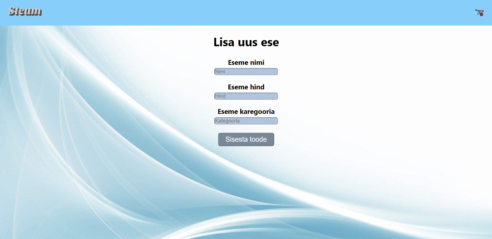

## Autor:
### Hans-Märten Liiu

Lisasin veebileheküljele staatilise backgroundi.
Nupule liikudes muutub nupp suuremaks, muudab värvi, kursor läheb pointeriks.
Üldiselt lihtsalt muutsin teksi stiili, teksti suurust ning õhku tekstide vahel, et veebilehte oleks mugavam jälgida.

## CSS kujunduse kuvatõmmised

